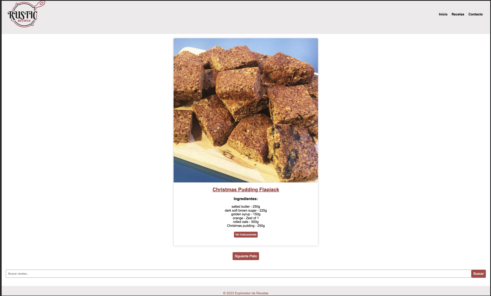
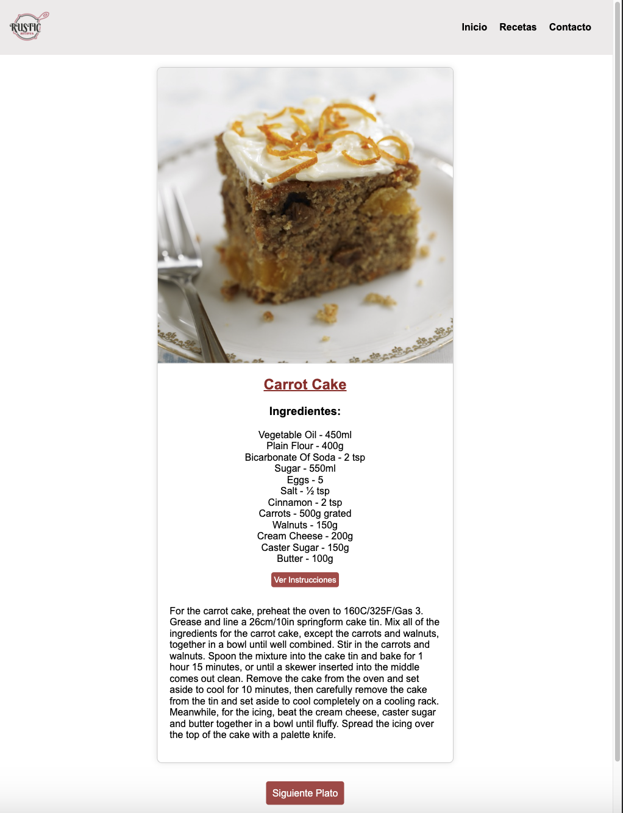

# Proyecto-IV---API---Recetas

<h1>Hola Soy Daniela Zapata</h1>

Bienvenido a: <h3>RUSTIC RECIPES,</h3> tu fuente de inspiración culinaria. Esta web ha sido creada con pasión para todos los amantes de la cocina que buscan nuevas ideas y deliciosas recetas para sorprender a sus seres queridos.

<h3>Características Principales</h3>
<h4></h4>Exploración de Recetas: Descubre una amplia variedad de recetas de todo el mundo.

<h4>Búsqueda Intuitiva:</h4> Encuentra tus recetas favoritas fácilmente con nuestro motor de búsqueda.
<h4>Detalle de Recetas:</h4> Cada receta viene con una detallada lista de ingredientes, instrucciones de preparación y una imagen atractiva.
<h4>Aleatorio y Divertido:</h4> ¿Te sientes inspiradx? Prueba nuestra función "Receta Aleatoria" para sorprenderte con platos nuevos y emocionantes.

<h3>Tecnologías Utilizadas</h3>
<h4>HTML:</h4> La estructura de la página está creada con HTML para una organización semántica y con accesibilidad.
<h4>CSS:</h4> Los estilos y el diseño visual se han implementado con CSS para una experiencia de usuario atractiva.
<h4>JavaScript:</h4> La interactividad y la dinámica de la página se han logrado mediante JavaScript para una experiencia más fluida.

<h3>Así se ve RUSTIC RECIPES</h3>
Página de inicio con una selección destacada de recetas.

<h4>Receta Detallada:</h4>
Detalles de una receta específica con lista de ingredientes, instrucciones y una imagen apetitosa.

<h4>Cómo Usar:</h4>
Cómo Usar
- Ingresa a Rustic Recipes.
- Explora las recetas destacadas en la página de inicio o utiliza la función de búsqueda para encontrar algo específico.
- Haz clic en una receta para obtener detalles, incluyendo ingredientes y pasos de preparación.

<h4>¡Disfruta de la cocina y comparte tus creaciones deliciosas!</h4>

<h4>Contribuciones</h4>
Si tienes alguna sugerencia de mejora, encontraste algún error o deseas contribuir, ¡nos encantaría recibir tu aporte! Por favor, abre un issue o envía un pull request.

<h4>Licencia</h4>
Este proyecto está bajo la Licencia MIT, lo que significa que eres libre de utilizar, modificar y distribuir el código como desees. ¡Esperamos que encuentres útil la aplicación y disfrutes cocinando!

<h3>¡Gracias por visitar RUSTIC RECIPES,</h3>Que tengas un día delicioso y lleno de sabores increíbles! 🍳🌮🍰
